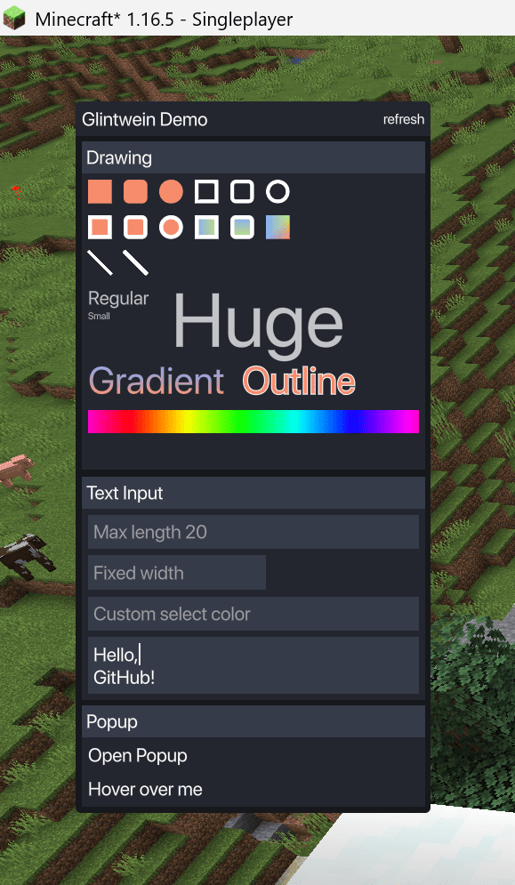

<div align="center">
 <h1>Glintwein</h1>
 <div>
  <a href="https://maven.xtrafrancyz.net/#/releases/net/glintwein">
   
  </a>
 </div>
</div>

Glintwein is a **client-side Minecraft UI framework/mod** focused on building custom HUDs and in-game windows with a
shared rendering/runtime layer between Minecraft versions and mod loaders.

## Demo

Full code for the demo shown below is available
in [DemoWindow.java](common/src/main/java/net/glintwein/demo/DemoWindow.java).



## Features

- Client-side UI layer and window manager pipeline.
- Elements based on [facebook/yoga](https://github.com/facebook/yoga) flexbox layout.
- MSDF font rendering (supporting any scale without quality loss).
- Shader-based rendering pipeline with rounded borders etc.
- Shared rendering commands and composition primitives in `common/`.
- Multiple Minecraft version support.
- Multiple loader support.

## Supported Platforms

Current modules in this repository:

- **Minecraft 1.16.5 (Fabric)** - included in the root Gradle build.
- **Minecraft 1.16.5 (Forge)** - standalone Gradle project under `mod/1.16.5-forge/`.
- **Minecraft 1.21.4 (Fabric)** - standalone Gradle project under `mod/1.21.4-fabric/`.
- **Minecraft 26.1.2 (Fabric)** - standalone Gradle project under `mod/26.1.2-fabric/`.

## Usage

Glintwein is intended to be used as a library mod dependency.

For Fabric 1.16.5, add the following to your `build.gradle`:

```groovy
repositories {
    maven {
        url 'https://maven.xtrafrancyz.net/releases'
        content { includeGroup 'net.glintwein' }
    }
}

dependencies {
    modImplementation 'net.glintwein:glintwein-fabric:0.1.0+mc1.16.5'
}
```

You can check all available versions and loaders on [Maven](https://maven.xtrafrancyz.net/#/releases/net/glintwein).

In your mod's client initializer, you can then create and register windows with the Glintwein window manager:

```java
public class MyModClient implements ClientModInitializer {
    @Override
    public void onInitializeClient() {
        // Create a new window, use demo for example
        Window myWindow = new net.glintwein.demo.DemoWindow();
        // Register the window with the Glintwein window manager
        Glintwein.instance.layerIngame.getWindowManager().addWindow(myWindow);
    }
}
```

## Project Layout

- `common/` - shared UI engine, rendering pipeline, font loading, and platform abstraction.
- `version/*` - Minecraft-version-specific platform, mixin, and render implementations.
- `mod/*` - loader-specific wiring and mod metadata for each supported Minecraft version.
- `font/` - generated font atlases plus scripts/tools to regenerate them.

## Build

From the repository root:

```powershell
gradle :mod:1.16.5-fabric:build
```

Standalone module builds:

```powershell
.\mod\1.21.4-fabric\gradlew.bat build
```

## Development Notes

- Shared code is intended to stay Java 8 compatible for common and 1.16.5 targets.
- Keep Minecraft-specific behavior in `version/<mc-version>/` instead of branching shared runtime code.
- Loader modules should focus on wiring game events and calling into shared hooks.

## Fonts

Font atlas assets are generated and should not be edited by hand.

```powershell
.\font\gen.bat
```

See `font/README.md` for additional generation notes.

## Contributing

Issues and pull requests are welcome. When changing input hooks or rendering integration, keep loader and version wiring
aligned so behavior remains consistent across supported targets.

